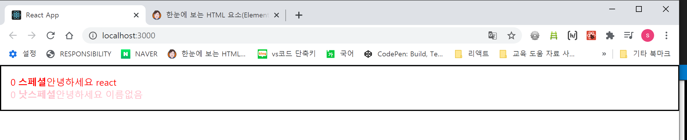

## 리액트 컴포넌트-2


### 컴포넌트 만들기 -Begin-react - 1. JSX문법


#### JSX 문법

리액트에서 컴포넌트의 생김새를 정의할때 사용하는 문법이다. 얼핏 HTML처럼 보이지만 사실은 자바스크립트 코드이다. 바벨의 도구를 사용해서 XML형태의 코드가 자바스크립트코드로 변환이되는것!

React.createElement를 통해서 컴포넌트를 만드는데 컴포넌트를 만들때마다 해당 함수를 직접호출하는 것이 어려우니 JSX문법을 사용해서 XML형태로 선언을 하면 자바스크립트 형태로 변환하게끔 하는 작업을 Babel 도구가 대신해준다. 다만 JSX문법을 잘 지켜야 Babel이 코드를 변환하는데 문제가 발생하지 않는다. 


##### 규칙

1. 태그는 꼭 닫혀야 한다! =>HTML 에서 input이나 br 같은 경우 따로 닫지 않고 사용하고 있는데 JSX에는 문제가 생기기 대문에 셀프 클로징을 반드시 해주어야한다. ex)  <input />

2. 두개이상의 태그는 꼭 하나의 태그로 감싸주어야하는데 이때 감싸주기위한 태그를 사용한다.(보통 <div>) 
   그러나  이때 굳이 감싸는 태그를 만들 필요 없는 경우  비어있는 태그(Fragment: 조각)를 사용해주어도 된다. Fragment를 사용하면 불필요하게 감싸는 태그를 브라우저 상에 만들지 않고 문법만 지켜서 오류가 안나게 해서 사용할 수 있다.

   빈태그 형태 : <></>오류는 나지 않지만 return 하는 XML 코드를 소괄호로 묶어주면 가독성 측면에서 좋다.

3. JSX 내부에서 자바스크립트 값을 사용할때는 자바스크립트의 템퍼럴리터럴 형태와 유사하게 {} 안에 표현식을 넣어 사용한다.

   ```
   {표현식}
   ```

4. 부수적으로 컴포넌트를 만들때  return 뒤에 오는 JSX 코드가 한줄이 아닌 경우 가독성을 위해 소괄호()로 감싸준다.

   

#### 컴포넌트 만들기 예제


```react
//index.js

import React from "react";
import ReactDOM from "react-dom";
import "./index.css";
import App from "./App";
import reportWebVitals from "./reportWebVitals";

ReactDOM.render(
  <React.StrictMode>
    <App />
  </React.StrictMode>,
  document.getElementById("root")
);

// If you want to start measuring performance in your app, pass a function
// to log results (for example: reportWebVitals(console.log))
// or send to an analytics endpoint. Learn more: https://bit.ly/CRA-vitals
reportWebVitals();

```


```react
//Hello.js

import React from "react"; //리액트를 불러와서 사용하겠다.

function Hello() {
  return <div>안녕하세요</div>;
  //XML형태의 값을 리턴해주어야함
}

export default Hello;

```


```react
//App.js

import React from "react";
import Hello from "./Hello";

function App() {
  const name = "react";
  return (
    <> 
      <Hello />
      <div>{name}</div>
    </>
  );
}

export default App;

```


#### Style과 className


**Style**

HTML에서 스타일을 설정할 때 인라인으로 사용하는경우 문자열을 사용했지만 JSX에서는 문법이 다르다.

```html
<div style="background:black;">{name}</div>		
```


JSX에서는 스타일 설정시 다음과 같이 객체를 만들어서 설정해주어야 한다

```react
 const style = {
	backgroundColor:'black',
	color:'aqua',
	fontSize :24,
	padding:'1rem'
}
```


1. 스타일 이름 중에는 background-color와 같은 단어와 단어가 연결된 경우가 있는데 JSX에서는 이런 스타일 이름을 camelCase(카멜케이스)로 네이밍하여 설정한다. 
2. 스타일 값 입력시 문자열로 표현해주어야 한다.
3. 숫자만 입력해주면 기본단위는  px이다
4. 단위를 따로 설정해주고 싶으면 문자열로 입력해주면 된다.


**className**

HTML에서 클래스를 사용할때 class 어트리뷰트를 사용했지만 JSX에서는 className을 사용한다.


```react
import React from "react";
import Hello from "./Hello";
import "./App.css";

function App() {
  const name = "react";
  const style = {
    backgroundColor: "black",
    color: "aqua",
    fontSize: 24,
    padding: "1rem",
  };
  return (
    <>
      <Hello />
      <div className="gray-box"></div>
      <div style={style}>{name}</div>
    </>
  );
}

export default App;

```


**주석**

주석을 작성할때는 중괄호로 감싸준다. 

```react
{/*어쩌고 저쩌고*/} 또는 // 어쩌고 저쩌고
```


------


### 컴포넌트 만들기 -Begin-react - 2.Props

#### 1.props

**props = <u>prop</u>ertie<u>s</u>

props란 우리가 컴포넌트를 사용하게될때 어떤 특정 값을 전달해주고 싶을 때 사용하는것이다.

키와 값의 형태로 인라인 형태로 넣어서 props를 전달 할 수 있다.


```react
//App.js
import React from "react";
import Hello from "./Hello";

function App() {
  return <Hello name="react" />;
}

export default App;

```


props를 전달 받을 때에는 컴포넌트 함수에서 props라는 params를 가져온다. 그렇게 하면 App.js 에서  Hello 컴포넌트로 전달한 props가 객체 형태로 들어가 있게된다.


```react
//Hello.js
import React from "react"; //리액트를 불러와서 사용하겠다.

function Hello(props) {
  console.log(props); //{name:"react"}
  return <div>안녕하세요 {props.name}</div>; // 	브라우저에 안녕하세요 react가 렌더링 된다.
  //XML형태의 값을 리턴해주어야함
}

export default Hello;

```


<p style="text-align:center" props를 콘솔로 출력한 결과></p>

<center>props를 콘솔로 출력한 결과</center>

------

#### **2.defaultProps**

특정 props 값을 빠뜨렸을때 기본값을 설정할 수도 있음


```react
Hello.defaultProps = {

 name: "이름없음",

};
```

name이란 props가 없을 때 Hello 컴포넌트에서 props.name을 사용하면 기본값으로 지정한 "이름없음"이라는 값을 디폴트로 하여 사용한다.

------

#### **3.props.children** 

컴포넌트 안에 내용을 조회하기 위해 사용한다. 아래 코드를 살펴보면 App.js파일에서 Wrapper 컴포넌트 안에 Hello컴포넌트가 2개 존재하며 App.js 에서 둘을 렌더링해주고 있는 것을  확인할 수 있는데 실제 브라우저에서는 렌더링이 되지 않고 있다. 이때 Wrapper.js에서 props.children을 통해 Wrapper가 감싸고 있는 2개의 Hello 컴포넌트를 조회해서 가져오므로써 Wrapper 컴포넌트 내부에서 렌더링이 되어지게하여 브라우저에서도 정상적으로 렌더링 될 수 있도록 할 수 있다.


```react
//App.js
import React from "react";
import Hello from "./Hello";
import Wrapper from "./Wrapper";

function App() {
  return (
    <Wrapper>
      <Hello name="react" color="red" isSpecial={true} />
      <Hello color="pink" />
    </Wrapper>
  );
}

export default App;

```


```react
//Wrapper.js
import React from "react";

function Wrapper({ children }) {
  const style = {
    border: "2px solid black",
    padding: 16,
  };
  return <div style={style}></div>;
}

export default Wrapper;
```


<center>Hello 컴포넌트가 렌더링 되지 않은 것을 알 수 있다.</center>

------


```react
//Wrapper.js
import React from "react";

function Wrapper({ children }) {
  const style = {
    border: "2px solid black",
    padding: 16,
  };
  return <div style={style}>{children}</div>;
}

export default Wrapper;

```



<center>Hello 컴포넌트가 렌더링되었다.</center>


------


#### **조건부 렌더링**

props의 값에 따라서 렌더링을 다르게 할 수 있다.


```react

//App.js 
//props의 값에 따라서 Hello 컴포넌트의 렌더링을 다르게 할 수 있다. 
 
import React from "react";
import Hello from "./Hello";
import Wrapper from "./Wrapper";

function App() {
  return (
    <Wrapper>
      <Hello name="react" color="red" isSpecial={true} />
      <Hello color="pink" />
    </Wrapper>
  );
}

export default App;

```


```react
//Hello.js

import React from "react"; //리액트를 불러와서 사용하겠다.

function Hello({ color, name, isSpecial }) {
  return (
    //XML형태의 값을 리턴해주어야함
    <div
      style={{
        // style={{}} 자바스크립트 값이기 때문에 {}, 값은 객체이기 때문에 객체리터럴 {}이라서 {{}}로 표현
        color, //color: color => color
      }}
    >
      {0} {/* falsy한 값은 렌더링을 안하는데 0은 예외적으로 렌더링됨 */}
      {/* {isSpecial ? <b>*</b> : null} */}
      {/* {isSpecial && <b>*</b>} */}
      {/* 단순히 보여주고 숨기는 것은 &&연산자를 이용한다. */}
      {/* isSpecial이 false이면 {}안에 값이 false로 평가되기때문에 렌더링 x,true면 우측 값으로 평가되어 렌더링 */}
      <b>{isSpecial ? "스페셜" : "낫스페셜"}</b>
      {/*특정 조건에 따라 값을 다르게 렌더링 하고자 하는 경우 삼항조건연산자를 사용한다. */}
      안녕하세요 {name}
    </div>
  );
}
//defaultProps:  특정 props 값을 빠뜨렸을때  기본값을 설정할 수도 있음
Hello.defaultProps = {
  name: "이름없음",
};
export default Hello;

```


------


#### **useState**

useState를 통해 컴포넌트에서 바뀌는 값 관리하기


```react
//Counter.js

import React from "react";

function Counter() {
  return (
    <div>
      <h1>0</h1> => 상태가 렌더링될 곳
      <button>+1</button> 
      <button>-1</button> 
    </div>
  );
}
export default Counter;

```


```react

//App.js
import React from 'react';
import Counter from "./Counter";

function App() {
  return <Counter />;
}

export default Counter;

```


리액트에서는 useState 함수를 사용해서 바뀌는 값을 관리할 수 있다.

상태의 기본값은 useState의 파라미터로 넣어주면 된다. 

ex)  useState(0) 상태의 기본값은 0

useState라는 함수는 배열을 반환하는데 첫번째 원소는 현재상태를 의미하고 두번째 원소는 이 상태를 바꾸는 함수로써 사용된다. 

아래 코드를 보면 number는 현재 상태를 의미하고(최초 렌더링시 기본값으로 입력한 0을 갖는다.) setNumber가 이 상태를 변경하는 함수로써 사용하겠다는 것을 알수 있다.


useState 함수를 통해 상태를 지정하고 그 상태를 변화시킬 함수는 배열 디스트럭쳐링을 하여 아래와 같이 좀 더 간결하게 선언할 수 있다.


```react
//Counter.js

import React, { useState } from "react"; //리액트에서 useState라는 함수를 불러온다.

function Counter() {
  const [number, setNumber] = useState(0);
  //우리가 number라는 상태를 만들건데 이 상태의 기본값은 0으로 하겠다
  //setNumber는 상태를 바꿔주는 함수이다.
  //useState을 호출하면 배열을 반환하는데 첫번째 원소는 number , 두번째 원소는 setNumber에 할당하겟다!

  const increase = () => {
    setNumber(number + 1);
    // 기존의 number라는 상태를 변경하고자한다면 () 안에 새롭게 변경하고자 하는 상태 값을 넣어서 호출해주면 이벤트가 발생될때마다 상태값이 변경된다.
  };
  const decrease = () => {
    setNumber(number - 1);
  };
  return (
    <div>
          
      <h1>{number}:상태</h1> 
      {/* 클릭이벤트 발생시 함수 실행 */}
      {/* 이벤트 이름에는 대문자가 들어간다 */}
      {/* 이벤트가 발생했을 때 실행할 함수를 {}안에 자바스크립트값으로 작성한다. */}
      {/* 주의할점은 함수호출을 해주면 안된다는 것이다. 
          만일 호출연산자와 함께 작성하면 리액트 컴포넌트가 렌더링 될때 호출되어버린다. 
          우리가 원하는 것은 이벤트가 발생할때 
          그 이벤트를 브라우저가 감지해서 함수를 호출하게 하고싶은 것이기 때문에 
          함수표현식만 넣어주면 된다.
      */}
      <button onClick={increase}>+1</button>
      <button onClick={decrease}>-1</button>
    </div>
  );
}
export default Counter;

```


**상태의 함수형 업데이트**

앞서 살펴본 상태의 업데이트 방법은 setNumber 함수를 호출할때 변경하고자 하는 업데이트 값을 인수로 넣어서 호출을 하면 해당 함수가 호출될때마다 상태가 변경되었다.

그런데 업데이트 하고 싶은 값을 넣어줄 때 함수를 넣어 **상태의 함수형 업데이트**를 구현할 수도 있다. 이 방법은 상태 값을 어떻게 업데이트 할지에 대한 로직을 정의하는 함수를 setNumber함수를 호출할 때 인자로 넣어주면 된다.  당장은 업데이트하고 싶은 값을 넣는 것과 함수를 넣는 것에 대해 차이를 못느낄 수 있겠지만 나중에 리액트 컴포넌트를 최적화하는 단계에서는 상태의 함수형 업데이트가 필요하다는 것을 알아두자.


```react
//Counter.js

import React, { useState } from "react"; //리액트에서 useState라는 함수를 불러온다.

function Counter() {
  const [number, setNumber] = useState(0);

  const increase = () => {
    setNumber(prevNumber => prevNumber + 1 ); => 업데이트 함수
    
  };
  const decrease = () => {
    setNumber(prevNumber => prevNumber - 1);
  };
  return (
    <div>
          
      <h1>{number}:상태</h1> 
      <button onClick={increase}>+1</button>
      <button onClick={decrease}>-1</button>
    </div>
  );
}
export default Counter;

```

