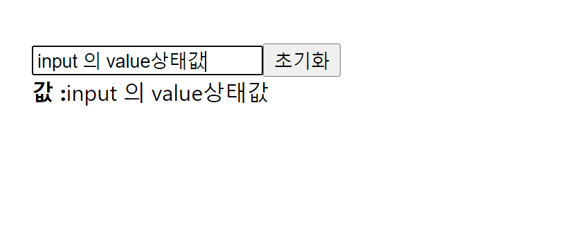
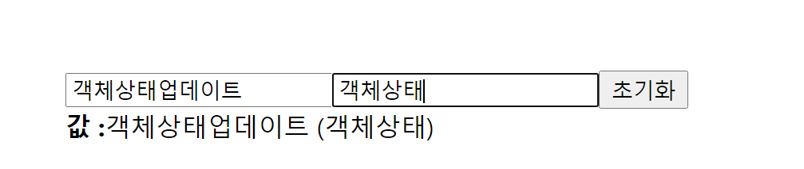

## 리액트 컴포넌트-3


### 컴포넌트 만들기 -Begin-react - 3.input 상태


#### Input 상태 관리

useState를 통해 input 상태를 관리해보자


```react
//App.js
import React from "react";
import InputSample from "./InputSample";

function App() {
  return <InputSample />;
}

export default App;

```


```react
//InputSample.js

import React, { useState } from "react";

function InputSample() {
  const [text, setText] = useState("");
  const onChange = (e) => {
    setText(e.target.value);
  };
  const onReset = (e) => {
    setText("");
    // e.target.previousElementSibling.value = "";
  };
  return (
    <div>
      <input onChange={onChange} value={text} />
      <button onClick={onReset}>초기화</button>
      <div>
        <b> 값 :</b>
        {text}
      </div>
    </div>
  );
}

export default InputSample;

```


input에 텍스트를 입력하면 Change이벤트를 감지하여 setText함수가 실행되는데 이 함수를 통해서 text(=>value값)의 상태를 업데이트해서 브라우저 화면에 보여주고 있는 것을 확인할 수 있다.

```react
  const [text, setText] = useState("");
  const onChange = (e) => {
    setText(e.target.value); //e.target      => input
      					   //e.target.value => input에 입력한 값
  };
```

초기화 버튼을 눌렀을때 text라는 상태값을 초기화해보자!

```react
  const onReset = (e) => {
    setText("");
    // e.target.previousElementSibling.value = "";
  };
```

```react
<button onClick={onReset}>초기화</button>
```


우리는 초기화 버튼을 클릭했을때 input에 입력된 값(value)도 같이 초기화해야하므로  input 태그에 value값으로 text 라는 상태를 넣어주었다. 

```react
<input onChange={onChange} value={text} />
```

그렇게 하면 버튼을 눌렀을때 click이벤트가 발생하고 setText('')가 실행되어 text의 상태값이 빈문자열로 업데이트가되는데(초기화) input요소가 text라는 상태를 value값으로 갖고있기때문에 input 의 입력창도 빈문자열로 업데이트가되면서 초기화가 된다.



#### 2개 이상의 Input 상태 관리

2개 이상의 여러개의 input 상태 관리는 어떻게 할까?

완성 코드는 다음과 같다.

```react

```


위의 코드를 좀 더 자세하게 살펴보자. 이름과 닉네임을 입력받을 input이 각각 1개씩 두개가 존재한다. 이 경우 상태는 객체로 관리해야 효율적이며 상태를 객체로 설정하는 것은 다음과 같다.

```react
 const [inputs, setInputs] = useState({
    name: "",
    nickname: "",
  });
```

그 다음 inputs 라는 객체상태에서 name,nickname 키에 해당하는 값을 각각 추출해주었다. input 박스에 텍스트를 입력하여 상태가 변경되면 name과 nickname의 값이 변경된다.

```react
const { name, nickname } = inputs;
```


다음은 이벤트가 감지되면 어떻게 동작할지 설정하는 부분이다. 

onChange 이벤트가 발생하면 이벤트가 발생한 대상 input의 name과 value 를 추출해준다. 그 다음엔  setInputs 함수를 호출하여 어떻게 상태를 업데이트 할지 지정해주어야 한다.

상태를 객체로 관리하고 있으므로 업데이트 될 상태로 객체로 관리하기 위해 setInputs함수의 인자로 객체를 넣어주면 된다.

이때 불변성을 지켜주기 위해 스프레드 문법을 통해 기존의 inputs객체상태를 복사하여 새로운 객체를 만든 후 텍스트를 입력한 input요소의 name= "name"인지 name="nickname"인지에 따라 객체상태의 특정 키 값을 업데이트 해주기 위해 name 을 대괄호로 감싸서 name프로퍼티키를 동적으로 받아온 뒤  입력 텍스트를 추출한 변수 value 를 그 값으로 할당하여 상태를 업데이트 해주었다.  

onReset이벤트가 발생하면 객체상태를 기존의 값으로 돌리기위해 최초의 inputs 상태와 동일한 값을 setInputs함수의 인자로 넣어주었다.

```react
 const onChange = (e) => {
    const { name, value } = e.target;
    // const nextInputs = {
    //   ...inputs,
    //   [name]:value
    // };
    // nextInputs[name] = value;
    //setInputs(value)

    //아래와 같이 sextInput을 만들지 않고 코드를 작성할 수 있다.

    setInputs({ //상태의 불변성을 위해 스프레드 문법으로 객체 상태를 복사해주었다.
      ...inputs,
      [name]: value, //onChange이벤트가 발생하면 특정 input의 값을 업데이트 해주었다.
    });
      
  };
  const onReset = (e) => {
    setInputs({
      name: "",
      nickname: "",
    });
  };
```


렌더링이 되어질 부분은 아래와 같다. input을 특정하기위해 name값을 name 과 nickname으로 지정하고 change이벤트를 달아주었으며 value값으로 각각 name과 nickname을 넣어주어 상태가 바뀌면 바뀐값으로 자동적으로 value에 할당되고 화면에 값: 으로 출력되도록 코드를 작성해준 것이다. 

```react
return (
    <div>
      <input name="name" placeholder="이름" onChange={onChange} value={name} />
      <input
        name="nickname"
        placeholder="닉네임"
        onChange={onChange}
        value={nickname}
      />
      <button onClick={onReset}>초기화</button>
      <div>
        <b> 값 :</b>
        {name} ({nickname})
      </div>
    </div>
  );
```



<center>결과 화면</center>


오늘 배운 내용 중 중요한 부분은 객체 상태를 업데이트할때는 기존의 객체상태를 복사한 뒤에 특정 값을 덮어쓰는 방식으로 상태를 업데이트 해주도록 설정해야한다는 것이다. 이는 불변성을 지켜주기 위함인데 이게 중요한 이유는 불변성을 지켜줘야만 리액트 컴포넌트에서 상태가 업데이트된것을 감지하고 이에 따라 필요한 렌더링을 발생시킬 수 있게되기 때문이다. 객체뿐만아니라 배열상태를 관리하게될 때에도 마찬가지로 불변성을 지켜주어야하며 참고로 불변성을 지켰을때 컴포넌트 업데이트 성능을 최적화 시킬 수 있다는 점 도 알고 있자!


