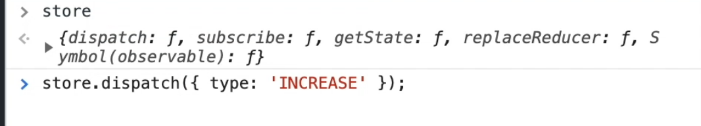
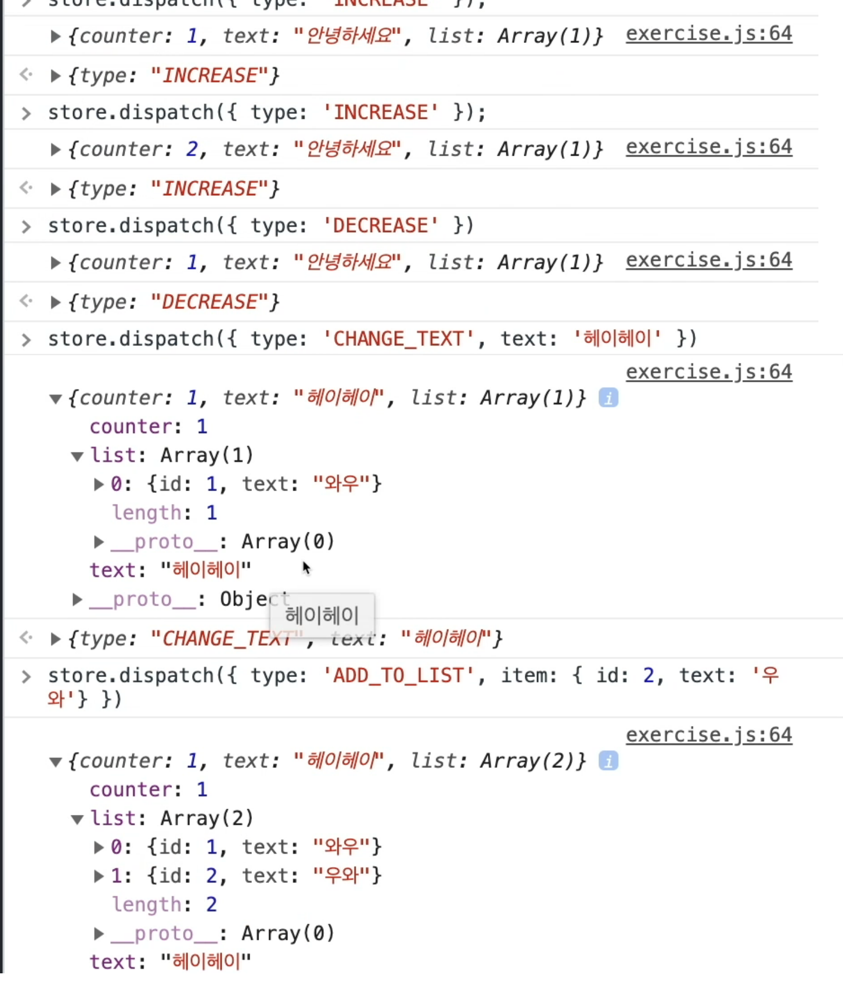
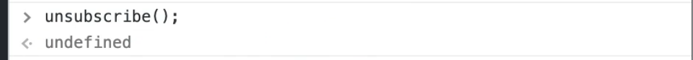
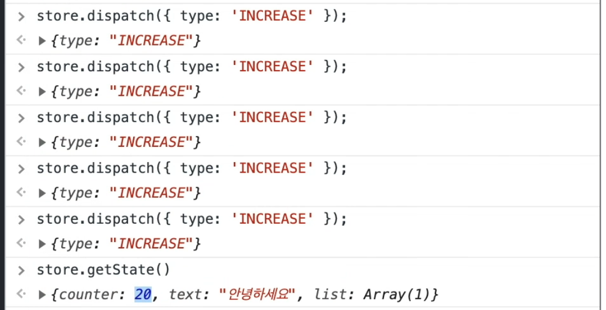

# react-redux


### **리덕스 (redux)**


리덕스는 React 생태계에서 가장 사용률이 높은 상태관리 라이브러리이다.

리덕스를 사용하면 만들게 될 컴포넌트 상태관리 로직들을 다른 파일들로 분리하여 더욱 효율적으로 관리할 수 있고 글로벌 상태관리도 손쉽게 할 수 있다.

이전에 배운 Context API를 사용해도 글로벌 상태를 관리할 수 있으며 컴포넌트 상태관리 로직들을 분리할 수 있고 Context API + useReducer 훅(Hook)을 사용해서 개발하는 흐름은 리덕스를 사용하는 개발 방식과 비슷하다.
(리덕스에서도 액션과 리듀서라는 개념을 사용하기 때문에)

리덕스는 ContextAPI가 지금의 형태로 사용방식이 개선되기 전에 또 useReducer 훅(Hook)이 존재하기 전부터 존재하던 라이브러리이다.

ContextAPI가 예전에는 불편했기 때문에 리액트 프로젝트에서 전역적인 상태를 관리할 때는 리덕스라는 라이브러리를 사용하는 것이 당연했었다.

자바스크립트 또는 앵귤러같은 다른 프레임워크에서도 	
사용할 수 있다. react-redux는 리액트 컴포넌트에서 리덕스를 사용하는 라이브러리다.

잘 활용하면 프로그램 개발 생산성에 아주 큰 도움을 줄 수 있는 도구지만 단순히 글로벌 상태 관리를 위한 목적이라면 또 글로벌 상태가 별로 없다면 ContextAPI를 활용하는 것만으로도 충분할 수 있다.


------

### **Context를 사용하는 것과의 차이점**


1. **미들웨어 사용 가능하다**=> 비동기 작업을 더욱 더 체계적으로 관리 가능

   

   ```
   미들웨어로 가능한 일은 다음과 같다.
   -특정 조건에 따라 액션이 무시되게 만들수 있다.
   -액션을 콘솔에 출력하거나, 서버쪽에 로깅을 할 수 있다
   -액션이 디스패치 됐을 때 이를 수정해서 리듀서에게 전달되도록 할 수 있다.
   -특정 액션이 발생했을 때 이에 기반하여 다른 액션이 발생되도록 할 수 있다.
   -특정 액션이 발생했을 때 특정 자바스크립트 함수를 실행시킬 수 있다.
   ```

2. **리액트 리덕스를 사용하면서 유용한 함수와 Hooks를 지원받아 사용가능하다**

   connect라는 함수를 사용하면 전역적인 상태 그리고 액션을 dispatch 하는 함수들을 props로 받아 사용 가능하고 useSelector, useDispatch, useStore 같은 Hooks를 사용하면  리덕스에서 관리하는 상태를 쉽게 조회하고 액션을 쉽게 dispatch 할 수 있다. contextAPI를 사용하면 이런 것들을 직접 만들어야 하므로 이미 잘 만들어져있는 것을 사용하는 게 좋다고 할 수 있다.

3. **기본적인 최적화가 이미 되어있다.**

   상태를 받아와서 사용을 하게 될 때 이미 최적화가 되어있어서 필요한 상태가 바뀔 때에만 리 렌더링 되는 기능이 탑재됨 (ContextAPI+useReducer를 사용하면 비슷하게 최적화는 되지만 따로 직접 뭔가 해야 할게 있음)

4. **하나의 커다란 상태**

   Context API를 사용하면 글로벌 상태를 관리할 때 기능별로 Context를 만들어서 사용하는 게 일반적! 반면 리덕스에서는 모든 글로벌 상태를 하나의 커다란 객체에 넣어 사용하는 게 필수. 그래서 매번 Context를 만들어 줘야 하는 수고스러움을 덜 수 있다.

5.**DevTools**

아주 유용한 개발자도구가 있는데 현재 상태를 한눈에 볼 수 있고 지금까지 어떤 변화가 있었는지 볼 수 있고 특정 시점으로도 상태를 되돌릴 수 있음

6.이미 사용중인 프로젝트가 많다.

리덕스를 사용하는 프로젝트가 많다.


```
리덕스를 쓰는것이 당연한가? 당연하지 않다. 

프로젝트의 규모가 큰 경우 리덕스를 쓰면 도움은 많이 될 수 있다 비동기 작업을 자주 하는 경우 리덕스와 리덕스 미들웨어를 사용하면 
좀 체계적이고 깔끔한 비동기 작업을 관리할 수 있다. 리덕스가 편하게 느껴지지 않는다면 ContextAPI 또는 MobX라는 리덕스를 대체할 수 있는 
상태 관리 라이브러리를 사용할 수 도 있다. 다만 MobX는 리덕스와 사용방식이 완전 다르지만, 굉장히 편한 라이브러리이므로 한 번쯤 사용해보면 좋다.
```


------

### **리덕스를 배우기 전 키워드 알기**

1. **액션 Action** 

   상태의 어떠한 변화가 필요할 때 우리는 Action 을 발생시킵니다. 이는 하나의 객체로 표현이 되는데 Action객체는 다음과 같은 형식으로 이루어져 있다.

    Action객체에는 타입이라는 값이 필수적으로 있어야 한다. 나중에 리덕스에서 상태를 업데이트할 때 이 타입을 보고 어떻게 업데이트할지 정한다. 

```react
{
	type:"TOGGLE_VALUE"
}
```

타입이외에도 다른 값들도 자유롭게 넣어줄 수 있다.

```react
{ //이 Action은 새로운 할일을 만드는 Action인거고 data라는 값을 통해 어떤 데이터를 추가 할건지에 대한 것을 나타낸다.
	type:"ADD_TODO"
	data:{
		id:0,
		text:"리덕스 배우기"
	}
}
```

```react
{ //이 Action은 input의 상태를 바꾸는 Action이고 text라는 "안녕하세요" 값으로 값을 바꾸겠다라는 것을 나타낸다.
	type:"CHANGE_INPUT"
	text:"안녕하세요"
	}
}
```

이처럼 Action이라는 것 자체는 어떤 업데이트를 해야 할 때 어떻게 업데이트를 해야 할지 정의하는 객체로 이해하자


2.**액션 생성 함수 Action Creator**

액션 생성 함수는 말 그대로 단순히 파라미터를 받아와서 객체를 만들어주는 함수이다. 액션 생성함수를 사용하는 것이 필수는 아니지만, 나중에 편하게 Action객체를 만들기 위함이다.액션 생성함수를 사용하지 않는다면 Action을 발생시킬 때마다 액션 객체를 작성해주면 됨

```react
//addTodo라는 함수를 만들어 data라는 파라미터를 받아 액션 객체를 만듬
export function addTodo(data){
    return {
        type:"ADD_TODO"
        data
    };
}
//액션 생성 함수는 화살표 함수로도 만들 수 있다.이 함수는 text 라는 파라미터를 받아 액션객체를 만듬
esport const changeInput = text => ({
	type:"CHANGE_INPUT",
	text
})
```

3. **리듀서**

   변화를 일으키는 함수이다.

   state,action이라는 두가지 파라미터를 가져온다. 리듀서 함수는 액션 타입이 무엇이냐에 따라서 다른 업데이트 작업을 한다. 
   리듀서에서는 불변성을 꼭 유지해주어야 한다. 만약 state가 숫자가 아니라 배열이나 객체인 경우 스프레드 연산자를 활용하거나 혹은 Object.assign,배열내장함수 concat을 사용해서 새로운 배열이나 객체를 만들어서 반환해야 함. 그리고 useReducer를 사용할 때는 일반적으로 default 부분에 에러를 발생시키는 게 일반적인데 리덕스의 리듀서에서는 기존의 state를 그대로 반환하는 형태로 작성해야 한다.
   
   리덕스를 사용할 때는 여러 개의 리듀서를 만들고 이를 합쳐서 루트 리듀서라는 것을 만들 수 있는데 루트 리듀서에 안에 있는 작은 리듀서들은 서브 리듀서라고 부른다.

   

   ```react
function counter(state,action){
     switch(action.type){
       case "INCREASE":
       	return state +1;
       case "DECRESE":
   
       	return state -1;
       default:
       	return state;
       }
   }
   ```
   
   

4. **스토어  (Store)**

리덕스를 사용하게 된다면 한 애플리케이션 당 하나의 store를 만들게 되는데 스토어 안에는 현재 앱의 상태와 리듀서가 들어있고 추가로 몇 가지 내장함수가 들어있다.

**내장함수**

​	**1.디스패치 (dispatch)**=>  액션을 발생시키는 것 또는 스토어에 액션을 전달하는 것 으로 이해할 것

```react
dispatch({type:'INCREASE'})
```

​	디스패치 함수는 액션 객체를 만들어서 디스패치 함수의 파라미터로 넣어서 호출하면 해당 액션이 리듀서한테 전달이되서
​	리듀서 함수에서 새로운 상태를 반환해주면 스토어의 상태가 새로워진다.

​	**2.구독 (subscribe)**=>  subscribe 함수를 호출할때 파라미터로 특정 함수를 넣어주면 액션이 디스패치(dispatch)될때마다 우리
​	가 설정한 함수가 호출된다. 

​	이를 통해서 어떤 작업을 할 수 있냐면 스토어의 상태가 업데이트될 때 마다 특정 함수를 호출할 수 있는 것이다. 

​	리액트에서 리덕스를 사용하게 될 때 보통 subscribe 함수를 직접 사용하게 되는 일은 없고 그 대신에 리액트 리덕스 라이브
​	러리에서 제공하는 Connect함수 또는 useSelector Hooks를 사용해서 만약에 스토어에 있는 상태가 업데이트 되면 컴포넌트
​	가 리 렌더링되는 작업을 대신 처리해준다. 그래서 나중에 컴포넌트를 만들게 되면 컴포넌트가 리덕스에 구독을 하기 때문
​	에 리덕스 상태가 업데이트되면 컴포넌트가 업데이트된다.


------

### **리덕스를 사용할때 지켜야하는 3가지 규칙**


**첫번째 규칙** 

​	**하나의 애플리케이션엔 하나의 스토어가 있다.** 

​	여러개의 스토어를 만드는 것이 가능은 하나 절대로 권장되지 않음 .만약 특정 어떤 업데이트가 빈번하게 일어나거나 애플
​	리케이션의 특정 부분을 완전히 분리시키게될 때는 여러개의 스토어를 만드는 경우가 있지만 개발자 도구를 제대로 활용못
​	하는 단점때문에 일반적으로 사용하진 않는다.


**두번째규칙**

​	**상태는 읽기 전용이다 => 불변성을 지키자!**

​	객체는 스프레드 연산자를 사용해서 기존의 객체를 복사해서 사용할것
​	배열의 경우 concat,filter,map,slice 같은 불변성을 지키는 내장함수를 사용할것 =>  push, splice, reverse같은 함수 쓰면 안됨 
​	리덕스에서 불변성을 지켜야하는 이유는 좋은 성능을 유지하기 위함이다! 불변성을 지켜야만 컴포넌트들이 제대로 리 렌더	링 된다는 것을 기억할 것!


**세번째규칙**

​	**변화를 일으키는 함수 리듀서는 순수한 함수여야 한다.**

​	리듀서로 새로운 상태를 만들때는 파라미터로 받은 state와 액션에만 의존해서 새로운 상태를 만들어야 함!똑같은 파라미터
​	로 호출된 리듀서 함수는 언제나 똑같은 결과값을 반환해야한다. 
​	즉,동일한 인풋 => 동일한 아웃풋의 결과가 나와야한다는 것을 기억할것!

```
주의할점
-new Date()=>현재 날짜를 가져오는 것은 호출할때마다 다른 값이 나오므로 사용 x
-Math.random()=>호출할때마다 다른 값이 나오므로 사용 x
-axios.get() 비동기작업/네트워크를 요청하는것도 사용 x
-리듀서 밖에 있는 어떤 변수에 의존해서도 안됨 
 => 변수가 아닌 상수라면 가능. 해당값은 언제든 같을테니까!
```

### **리덕스 사용할 준비하기-실습**


```react
import { createStore } from "redux";
// createStor -스토어를 만들어주는 함수를 불러와줌

//리덕스에서 관리할 상태를 정의해줌
const initialState = {
  //상태의 초기값으로 counter,text,list 총 세가지를 넣어줌
  counter: 0,
  text: "",
  list: [],
};
//액션 타입들을 정의 : 문자열 상수로 정의해서 4가지 액션을 만듬
const INCREASE = "INCREASE"; // 액션이 발생하면 couter 숫자를 +1
const DECREASE = "DECREASE"; // 액션이 발생하면 couter 숫자를 -1
const CHANGE_TEXT = "CHANGE_TEXT"; //액션이 발생하면 text 값을 변경
const ADD_TO_LIST = "ADD_TO_LIST"; //액션이 발생하면 list에 특정 항목을 추가

//액션 생성 함수
// function increase(){ return { type:INCREASE, }}

//액션 생성 함수는 웬만하면 화살표함수로 만듬
//힘수이름은 소문자 ! 액션 타입은 대문자로 작성 ! 언더바가 있는 경우 카멜케이스로 작성!
const increase = () => ({
  type: INCREASE,
});
const decrease = () => ({
  type: DECREASE,
});

const changeText = (text) => ({
  type: CHANGE_TEXT,
  text,
});

const addToList = (item) => ({
  type: ADD_TO_LIST,
  item,
});

//리듀서 작성 state,action을 파라미터로 가져옴
function reducer(state = initialState, action) {
  //state에 기본값(initialState)을 설정해줘야함
  // 리덕스에서 초기상태를 만들때 reducer를 한번 호출하는데 그 시점에
  //state가 undefined면 default :return undefined가 되면서 초기상태가 만들어지지 않으니까
  //기본값으로 initialState을 지정해서 state가 undefined면 initialState를 반환하게끔 해주어야 한다.
  switch (
    action.type //action타입이 무엇이냐에 따라 다른 작업을 해줌
  ) {
    case INCREASE:
      return {
        ...state,
        counter: state.counter + 1, //기존에 state의 couter값을 읽어서 1을 더하고 기존 상태는 유지시키고(불변성지킴) 반환하겠다.
      };
    case DECREASE:
      return {
        ...state,
        counter: state.counter - 1,
      };
    case CHANGE_TEXT:
      return {
        ...state,
        text: action.text, //action에 text값을 넣어줫으니 그값을 받아와서 대체시켜 줌
      };
    case ADD_TO_LIST:
      return {
        ...state,
        list: state.list.concat(action.item), //기존 list에 새로운 item을 추가한 새로운 배열을 만들어서 기존 list를 대체 ,불변성을 지키기 위해 concat 사용
      };
    default:
      return state; //만약에 위에서 처리하지 못한 액션의 경우에는 state를 유지하겠다.
  }
} //리듀서 완성 -끝-

//리듀서 완성되면 리듀서를 사용해서 스토어를 만들 수 있음
const store = createStore(reducer); //createStore를 호출하고 이 안에 reducer를 넣어주면 끝

console.log(store.getState()); //store.getState() : 현재 스토어안에있는 상태를 조회함
//{counter:0,list:[],text:""} 이렇게 초기상태가 잘 만들어진것을 콘솔창에서 확인할 수 있음

//스토어 안에 초기상태가 잘 지정된것을 확인했으니 구독을하고 디스패치를 해보자

//우선 스토어에 구독을 하기위해서 listener라는 함수를 만들어보자
const listener = () => {
  const state = store.getState(); //state를 조회해서 콘솔에 출력
  console.log(state);
};

//listener라는 함수를 스토어에 구독하기위한 코드
const unsubscribe = store.subscribe(listener);
//unsubscribe(); //구독해제 :store.subscribe(listener)를 호출하면 unsubscribe함수를 만들어주고 만약 나중에 구독을 해제하고 싶으면 이 함수를 호출해주면 됨

//액션들을 생성하고 디스패치 해보자
store.dispatch(increase());
store.dispatch(decrease());
store.dispatch(changeText("안녕하세요"));
store.dispatch(addToList({ id: 1, text: "와우" }));
//구독을 하고 나서 액션들을 디스패치해주면 디스패치될때마다 subscribe함수가 호출되어 
//콘솔에 현재 상태가 출력됨

window.store = store; //이렇게 하면 store인스턴스를 콘솔에서도 사용가능하다.

```





콘솔에서 store.dispatch해주면 리듀서가 한번 호출되고 액션 타입에 정의된 업데이트방식으로 스토어의 상태가 한번 업데이트되면서 구독했던 리스너가 호출되어 콘솔에 현재 상태가 출력됨.

=> 디스패치하면 상태가 업데이트가됨!




위의 이미지처럼 스토어가 특정 액션이 디스패치되면 스토어의 상태가 업데이트되고 상태가 업데이트되면서 우리가 구독했던 함수가 호출된다.





근데 여기서 unsubscribe를 호출하게 되면 구독한 listener함수가 호출되지 않게 됨
(위에 콘솔 출력 결과를 보면 상태는 디스패치 할 때마다 업데이트된것을 알 수있다. 하지만 listener함수가 호출되지 않아 콘솔에 상태가 출력되지 않음)

우리가 앞으로 리액트에서 리덕스를 사용하게 될 때는 subscribe함수를 사용하지 않는다. 그리고 store.getState()를 직접적으로 사용하는 일도 나중에 미들웨어를 사용하기 전까지는 잘 없다. 그 대신 connect,useSelector,useDispatch,useStore 같은 헬퍼 Hooks를 통해서 리액트와 리덕스를 연동하게 된다.

