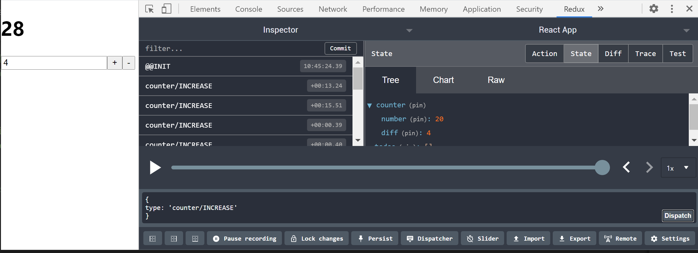
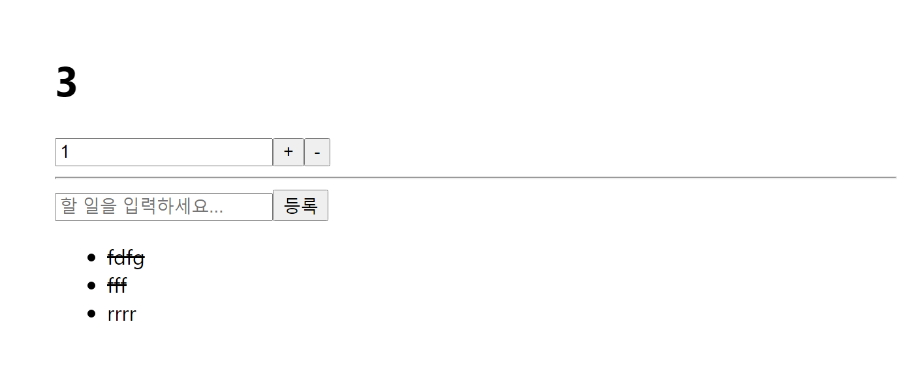

### 리덕스 모듈 만들기

리덕스 모듈이란 액션 타입,액션 생성 함수,리듀서 가 모두 들어있는 자바스크립트 파일을 의미한다.리덕스를 사용하기 위해 필요한 액션 타입,액션 생성 함수,리듀서 는 각각 다른 파일에 저장할 수도 있다.

한파일에 몰아서 작성해보자 -Ducks패턴이라 칭함

Ducks패턴은 한 파일에 액션 타입,액션생성함수,리듀서 함수도 선언하는 패턴이다. 주의할 점은 reducer 함수는 export default로 내보내주고 액션 생성 함수는 export로 내보내준다는 점이다.

이렇게 작성된 파일을 리덕스 모듈이라고 하며 나중에 액션 생성 함수를 불러올때 하나씩불러오거나 한꺼번에 불러올 수도 있다. Ducks패턴은 특히 리덕스를 처음 배우는 과정에서 사용하면 정말 쉽고 편하다. (리덕스 관련 코드들을 불리하는 방식은 정해지지 않았기 때문에 자유롭게 변경해도 상관은 없다.)


모듈을 만들때는 다음 순서를 기억하자

1.액션 타입 선언
2.액션생성함수 선언
3.초기상태 선언
4.리듀서를 만듬 리듀서에서 state=초기상태를 지정해주고 액션타입이 뭐냐에따라서 다른 작업을 하게 한다.
5.아래와 같이 루트리듀서를 만들어 여러개의 리듀서들을 하나로 합쳐주도록 한다.

```react
import { combineReducers } from "redux"; 
import counter from "./counter"; 
import todos from "./todos"; 


const rootReducer = combineReducers({
  counter,
  todos,
});


export default rootReducer;


```


### 리덕스 모듈 만들기 -실습

다음과 같이 리덕스 모듈을 만들어보자!

두개의 모듈을 만드는데 첫번째 모듈은 counter이다

```react
//modules/counter.js


//1.우선 액션타입부터 선언하자
//Ducks 패턴을 사용할때는 액션 타입 선언시 문자열 앞부분에 counter/접두사를 붙임 다른 이름과 중복되지 않기 위해 모듈 이름을 앞에 붙인 것이다.
const SET_DIFF = "counter/SET_DIFF"; //나중에 counter에서 + , -를 할 수 있게 할 건데 몇씩 더할지 정하는 것
const INCREASE = "counter/INCREASE";
const DECREASE = "counter/DECREASE";

//2.그 다음으로 액션 생성 함수 작성
//export  키워드 => 내보내줘서 나중에 불러와서 사용함
export const setDiff = (diff) => ({ type: SET_DIFF, diff }); //파라미터로 받은 diff값을 액션 객체 내부에 넣어줌
export const increase = () => ({ type: INCREASE }); //따로 받아오는 파라미터는 없다.
export const decrease = () => ({ type: DECREASE }); //따로 받아오는 파라미터는 없다.

//3.리듀서에서 관리한 초기 상태 선언해줌- 모듈의 초기 상태!
const initialState = {
  //두가지 값을 관리함
  number: 0,
  diff: 1, //나중에 increase,decrease할때 1씩 +,- / 이 값을 바꿀 수 있게 할 예정 만약 5로 바꾸면 5단위로 +,-
};

//4.리듀서 만듬
//초기 상태는 initialState로! 액션받아와서 액션 타입에 따라 상태를 다르게 업데이트해주도록 작성.
export default function counter(state = initialState, action) {
  switch (action.type) {
    case SET_DIFF:
      return {
        ...state,
        diff: action.diff,
      };
    case INCREASE:
      return {
        ...state,
        number: state.number + state.diff,
      };
    case DECREASE:
      return {
        ...state,
        number: state.number - state.diff,
      };
    default:
      return state;
  }
}

```

두번째 모듈은 todos이다

```react
//modules/todos.js

const ADD_TODO = "todos/ADD_TODO"; //할일 항목 추가하는 액션
const TOGGLE_TODO = "todos/TOGGLE_TODO"; //할일 항목 체크를 하는 액션

let nextId = 1; //id값을 가져와서 사용하기 위해 변수로 선언하고 1로 초기화
//이제 액션 생성 함수를 선언해보자
export const addTodo = (text) => ({
  type: ADD_TODO,
  todo: {
    id: nextId++, //새로운 todo항목을 만들 때 id값을 필요로 함, 한번 호출하면 아이디값을 +1해줌
    text, //text를 받아와 넣어줌
  },
});
export const toggleTodo = (id) => ({
  //특정 아이디를 선택해서  toggle해줄것이기 때문에 파라미터로 id값을 받음
  type: TOGGLE_TODO,
  id, //id를 받아와 넣어줌
});

//초기 상태도 선언해주는데 제일처음엔 데이터가 없기때문에 일단 빈배열로 선언해줌!
const initialState = [
  /*이런식으로 추후 배열에 어떤식으로 데이터가 들어갈지 참고용으로 주석 달아놓으면 좋음
{
    id:1,
    text:'예시',
    done:false
}
*/
];

//todos라는 리듀서를 만들고 export default로 내보내줌
export default function todos(state = initialState, action) {
  switch (action.type) {
    case ADD_TODO:
      return state.concat(action.todo); //state가 바로 배열타입이므로 바로 concat 메서드 사용가능
    case TOGGLE_TODO: //불변성을 지키면서 특정 id값 가진 항목을 찾아서 done값을 반전시켜줘야 함 => map 사용
      return state.map((
        todo //todo 항목을 가지고 만일에 todo.id와 action을 통해서 가져오는 id와 일치하면 해당 todo항목을 복사하고  done값을 반전시켜줌
      ) => (todo.id === action.id ? { ...todo, don: !todo.done } : todo));
    default:
      return state;
  }
}

```

modules/index.js 에 루트 리듀서를 만들어서 counter.js,todos,js 이 두개의 모듈에 있는 각각의 counter,todos 리듀서를 합쳐준다.

```react
//modules/index.js

import { combineReducers } from "redux"; //루트 리듀서를 만들 때에는 combineReducers라는 함수를 redux에서 받아와서 사용
import counter from "./counter"; //counter리듀서 불러오기
import todos from "./todos"; //todos리듀서 불러오기

//루트 리듀서 만들기
const rootReducer = combineReducers({
  counter,
  todos,
});

//두개의 리덕스 모듈을 만들었고 거기 있는 리듀서들을 합쳐서 루트 리듀서를 만듬
//그리고 루트 리듀서를 내보내줌
export default rootReducer;


```

리액트 프로젝트에 리덕스를 적용하는 방법 우선 다음 패키지를 설치하기위해 터미널에 해당 코드를 입력한다.

```bash
$ yarn add react-redux
```

그리고 index.js.에서 다음과 같이 코드를 작성해준다.

```react
//src/index.js

import React from "react";
import ReactDOM from "react-dom";
import "./index.css";
import App from "./App";
import reportWebVitals from "./reportWebVitals";
// import "./exercise";
import { Provider } from "react-redux"; //리액트 리덕스에서 provider를 불러와서 리액트 프로젝트에서 리덕스를 적용할 수 있음
import { createStore } from "redux"; // createStore store를 만들어주는 리덕스의 함수
//createStore사용할 때는 reducer를 파라미터로 넣음
//reducer를 파라미터로 넣으려면 rootReducer를 불러와야함
import rootReducer from "./modules"; // 우리가 modules에서 index.js라는 이름으로 rootReducer를 내보내주었다.
//만약 src의 index.js에서 modules 디렉토리를 불러오게되면 바로 modules의 index.js를 바로 불러오게됨

//스토어만듬
const store = createStore(rootReducer);
console.log(store.getState());

//리액트 프로젝트에서 리덕스를 적용해보자!
//App컴포넌트를 Provider로 감싸줌
ReactDOM.render(
  // Provider의 props를 통해서 store 값을 설정해줌
  //이렇게 하면 리액트 컴포넌트 어디서든지 스토어를 사용할 수 있게 됨!
  <Provider store={store}>
    <App />
  </Provider>,
  document.getElementById("root")
);

// If you want to start measuring performance in your app, pass a function
// to log results (for example: reportWebVitals(console.log))
// or send to an analytics endpoint. Learn more: https://bit.ly/CRA-vitals
reportWebVitals();

```

### 카운터 구현

리액트와 리덕스를 연동해서 카운터를 구현해보자!

우선 프레젠테이셔널 컴포넌트를 만든다.

```react
//components/Counter.js

//프레젠테이셔널 컴포넌트 -리덕스 스토어에 직접적으로 접근하지않고 필요한 값,함수를 props로 받아와서 사용하는 컴포넌트를 말한다.
//Counter.js => 프레젠테이셔널 컴포넌트

import React from "react";

function Counter({ number, diff, onIncrease, onDecrease, onSetDiff }) {
  //props를 통해서 상태와 함수들을 가져올것이다
  //우리가 여기에 인풋하나를 만들건데 input의 value를 onSetDiff안에 넣어 호출하기위해

  const onChange = (e) => {
    onSetDiff(parseInt(e.target.value, 10)); //e.target.value가 문자열이므로 숫자로 형변환해줘야함
  };
  return (
    <div>
      <h1>{number}</h1>
      <div>
        <input type="number" value={diff} onChange={onChange} />
        <button onClick={onIncrease}>+</button>
        <button onClick={onDecrease}>-</button>
      </div>
    </div>
  );
}
//프레젠테이셔널 컴포넌트의 개발이 끝났다.
//프레젠테이셔널 컴포넌트는 주로 UI를 선언하는것에 집중하고 필요한 함수나 값은 props로 받아와서 사용한다.

export default Counter;

```

그 다음 컨테이너 컴포넌트를 만든다.

```react
//containers/CounterContainer.js

//컨테이너 컴포넌트란 리덕스에 있는 상태를 조회하거나 액션을 디스패치 할수있는 컴포넌트를 의미한다.
import React from "react";
import Counter from "../components/Counter"; // Counter컴포넌트를 렌더링해줌
import { useSelector, useDispatch } from "react-redux"; //상태조회할때는 useSelector를 사용한다.
import { increase, decrease, setDiff } from "../modules/counter";

function CounterContainer() {
  const { number, diff } = useSelector((state) => ({
    //state가 가리키는 것은 우리가 만든 store에서 getState()해서 반환되는 객체:상태 이다.
    number: state.counter.number,
    diff: state.counter.diff,
  }));
  const dispatch = useDispatch(); //useDispatch(): 언제든지 dispatch를 통해 특정 액션을 발생시킬 수 있음

  const onIncrease = () => dispatch(increase()); //onIncrease가 호출되면 counter.js의 액션 생성함수 increase가 호출되면서 액션이 만들어지고 디스패치가 된다.
  const onDecrease = () => dispatch(decrease()); //onDecrease가 호출되면counter.js의 액션 생성함수 decrease가 호출되면 액션이 만들어지고 디스패치가 된다.
  const onSetDiff = (diff) => dispatch(setDiff(diff)); //onSetDiff가 호출되면 counter.js의 액션 생성함수 setDiff에 파라미터로 diff를 넣어주면서 diff값이 들어가있는 액션이 만들어지고 디스패치가 된다.

  // number, diff, onIncrease,onDecrease,onSetDiff 이것들을 그다음 Counter 컴포넌트에 하나하나 전달해줌
  return (
    <Counter
      number={number}
      diff={diff}
      onIncrease={onIncrease}
      onDecrease={onDecrease}
      onSetDiff={onSetDiff}
    />
  );
}
//컨테이너 컴포넌트 개발이 모두 끝났다.
//리액트 컴포넌트에서 리덕스를 연동할때는 useSelector, useDispatch라는 훅을 사용한다.
//useSelector는 상태를 조회하는 훅이다. 그래서 useSelector 안에 함수를 넣어주는데 해당함수의 파라미터에서는 state를 가져오는데 이 state가 바로 리덕스의 현재 상태이다.
//리덕스의 현재상태에서 어떤것을 불러올것이냐 했을 때 number랑 diff를 가져올거라해서 객체를 반환해주면 그것을 디스트럭쳐링 할당해 number와 diff를 추출해서 따로 사용가능하게 해주었다.
//그리고 액션을 디스패치할때는 useDispatch라는 훅을 사용하는데 그래서 useDispatch() 하게되면 dispatch 함수를 사용할 수 있게 됨
export default CounterContainer;

```

App 컴포넌트에서 CounterContainer 컴포넌트를 렌더링 한다.

```react
//App.js

import React from "react";
import CounterContainer from "./containers/CounterContainer";

function App() {
  return <CounterContainer />;
}

export default App;

```

리액트 컴포넌트에서 리덕스를 사용할때 프리젠테이셔널 컴포넌트와 컨테이너 컴포넌트를 분리해서 작업을 했는데 프리젠테이셔널 컴포넌트에서는 단순히 UI를 선언하는것에만 더 집중하고 상태관리는 컨테이너 컴포넌트에서 하도록 맡겨서 컨테이너 컴포넌트에서 리덕스 스토어 상태를 불러오고 어떤 액션 생성 함수가 호출되면 액션이 생성되는데 이 액션을 디스패치되는 작업을 처리해주었다.

프리젠테이셔널 컴포넌트에서는 버튼이 클릭되면 받아온 props를 호출하고 받아온 값을 특정 부분에서 보여주는 형태로 구현해주었다. 이렇게 둘을 분리해서 사용하면 프리젠테이셔널 컴포넌트의 재사용률도 높여줄수도 있고 관심사를 분리할 수 있기 때문에 굉장히 유용한 패턴이라고 할 수 있다.

이 패턴은 리덕스의 창시자가 공개한 것으로 리덕스를 사용하는 사용자에게 당연시 여겨져 왔다.
(리덕스 메뉴얼에서도 이에대해 언급되기도 함) 컨테이너와 프레젠테이셔널 컴포넌트를 나눈것은 복잡한 상태 로직을 분리시키기 위함이었는데 Hooks를 사용해도 비슷한 작업을 할 수 있다.

### **리덕스 개발자 도구 적용하기**

리덕스 개발자 도구를 사용하면 현재 스토어의 상태를 개발자 도구에서 조회할 수 있고 지금까지 어떤 액션들이 디스패치 되었는지 그리고 액션에 따라 상태가 어떻게 변하여왔는지 확인 할 수 있고 액션의 상태를 뒤로 되돌릴 수도 있으며 액션을 개발자도구에서 바로 디스패치 할 수도 있다.

1.브라우저에서 redux devtoos 확장 프로그램을 추가해준다.

2.터미널에서 아래 코드를 입력한다.

```bash
$ yarn add redux-devtools-extension
```

3.프로젝트 파일에서 composeWithDevTools함수를 불러와준다.

```react
import { composeWithDevTools } from "redux-devtools-extension"; //
```

4. createStore 안에 두번째 파라미터로 composeWithDevTools를 호출해준다.

```react
const store = createStore(rootReducer, composeWithDevTools());
```

이렇게 하면 개발자도구에서 리덕스 상태를 조회하고 디스패치도 할 수 있고 디스패치된 모든 액션 내역을 볼 수 있다.



<center>페이지에서 리덕스 개발자도구를 열면 나오는 화면</center>

### TodoList 구현


리덕스 모듈에 기반해서 Todo리스트를 구현해보자

우선 todos 프리젠테이셔널 컴포넌트 3개를 Todos.js라는 파일에 아래와 같이 코드를 작성한다.

```react
//components/Todos.js
//프리젠테이셔널 컴포넌트 3개 => TodoItem(할일항목1개 보여줌),TodoList(여러개 할일 항목을 보여줌),Todos( TodoList와 새로운 항목을 등록할 수 있는 폼을 렌더링)

import React, { useState } from "react";

//TodoItem컴포넌트 만들기
//todo,onToggle props를 가져옴
//todo객체는 todos 리덕스 모듈에서 관리하고 있는 배열안에 todo 객체

//React.memo로 최적화
const TodoItem = React.memo(function TodoItem({ todo, onToggle }) {
  return (
    <li
      style={{
        textDecoration: todo.done ? "line-through" : "none",
      }}
      onClick={() => onToggle(todo.id)}
    >
      {todo.text}
    </li>
  );
});
//TodoList컴포넌트 만들기
//todos,onToggle props를 가져옴
//todos는 여러개의 todo가 들어있는 배열
//React.memo로 최적화

const TodoList = React.memo(function TodoList({ todos, onToggle }) {
  return (
    <ul>
      {todos.map((todo) => (
        <TodoItem key={todo.id} todo={todo} onToggle={onToggle} />
      ))}
    </ul>
  );
});
//Todos 컴포넌트
//Todos,onCreate,onToggle props를 가져옴
//여기서는 상태관리를 해줄건데 근데 그 상태 관리를 리덕스에서 하지않고 로컬 useState를 사용해서 관리해줌
//리덕스를 사용한다고 해서 모든 상태 관리를 리덕스를 통해서만 해야하는것은 아님
//=> 필요한 경우에 컴포넌트내부에서 로컬 스테이트 즉, useState 훅을 사용해서 관리해줘도됨
//React.memo로 최적화

function Todos({ todos, onCreate, onToggle }) {
  const [text, setText] = useState("");
  const onChange = (e) => setText(e.target.value);
  const onSubmit = (e) => {
    e.preventDefault();
    onCreate(text);
    setText("");
  };
  return (
    <div>
      <form onSubmit={onSubmit}>
        <input
          value={text}
          onChange={onChange}
          placeholder="할 일을 입력하세요..."
        />
        <button type="submit">등록</button>
      </form>
      <TodoList todos={todos} onToggle={onToggle} />
    </div>
  );
}

export default React.memo(Todos);

```


그 다음 아래와 같이 TodosContiner 컨테이너 컴포넌트를 만든다.

```react
//containers/TodosContainer.js

import React, { useCallback } from "react";
import { useSelector, useDispatch } from "react-redux";
import Todos from "../components/Todos";
import { addTodo, toggleTodo } from "../modules/todos"; //액션생성함수를 불러온다.

// useSelector를 통해서 상태를 조회
//useDispatch()를 통해서 스토어의 디스패치를 사용함
function TodosContainer() {
  const todos = useSelector((state) => state.todos);
  const dispatch = useDispatch();

  //함수들을 재사용할 수 있도록 useCallback을 사용해서 최적화를 해줌 ,ESLINT규칙상 []안에 dispatch입력
  const onCreate = useCallback((text) => dispatch(addTodo(text)), [dispatch]); //파라미터로 받은 text를 넣고 addTodo액션 생성함수가 호출됨=> 액션객체 생성 =>디스패치되면 리듀서에서 상태를 업데이트해줌

  const onToggle = useCallback((id) => dispatch(toggleTodo(id)), [dispatch]); //파라미터로 받은 id를 넣고 toggleTodo액션 생성함수가 호출됨=> 액션객체 생성 =>디스패치되면 리듀서에서 상태를 업데이트 해줌

  return <Todos todos={todos} onCreate={onCreate} onToggle={onToggle} />;
}

export default TodosContainer;

```

그다음 App.js에서 렌더링을 해준다.

```react
import React from "react";
import CounterContainer from "./containers/CounterContainer";
import TodosContainer from "./containers/TodosContainer";

function App() {
  return (
    <div>
      <CounterContainer />
      <hr />
      <TodosContainer />
    </div>
  );
}

export default App;

```

### connect HOC 함수

connect HOC 함수를 통해 클래스형 컴포넌트에서 리덕스를 연동하는 방법에 대해 알아보자.

(HOC란? 재사용되는 값 함수를 props를 통해서 받아올수 있게 해주는 옛날 패턴이다. 이 패턴은 현재 Hook이 대체하고있기 때문에 잘 사용하지 않는다.)

이 함수는 사실 별로 쓸 일은 없다. 이 함수보다 우리가 이전에 배운 useSelector와 useDispatch를 사용하는 것이 우선되어야 한다. 컴포넌트를 만들 때 함수형 컴포넌트로 작성하는 것이 우선되어야 하지만 어쩔 수 없이 클래스 형 컴포넌트로 작성해야 하는 경우도 생기기 때문에 (옛날에 만든 컴포넌트라든지 함수형 컴포넌트로는 구현할 수 없는 예를 들어 component did catch 같은 라이프사이클 메서드를 쓴다든지 하는 경우에 ) 사용하는 함수이다.

이 함수를 사용하면 컴포넌트의 Props를 통해서 리덕스의 상태 또는 액션을 디스패치하는 함수를 받아올 수 있다. 옛날에는 connect 함수를 사용하는 것이 메인이었으나 2019년 중순쯤에 useSelector와 useDispatch가 소개되면서 더 이상 connect를 쓸 이유가 없어졌는데 그래도 필요한 경우가 있으니 알아두면 좋을 것이다.

connect을 사용하는 것이 클래스형 컴포넌트에서 리덕스와 연동하는 유일한 방법이긴 하지만 HOC이기때문에 함수형 컴포넌트에서 사용법이 다를게 없으므로 connect를 꼭 클래스형 컴포넌트에서만 쓸 필요는 없다 )


위에서 살펴본 hook으로 작성한 컨테이너 구현 예제처럼  connect를 사용하여 새롭게 컨테이너를 구현해보자


1.connect를 사용해서 counter 컨테이너를 구현해보자

```react
import React from "react";
// import { bindActionCreators } from "redux";
import Counter from "../components/Counter";
import { connect } from "react-redux";
import { increase, decrease, setDiff } from "../modules/counter";

// function CounterContainer({ number, diff, onIncrease, onDecrease, onSetDiff }) {
//bindActionCreators사용하면서 props 이름이 달라짐 onIncrease=> increase ....
function CounterContainer({ number, diff, increase, decrease, setDiff }) {
  return (
    <Counter
      number={number}
      diff={diff}
      onIncrease={increase} //{onIncrease}
      onDecrease={decrease} //{onDecrease}
      onSetDiff={setDiff} //{onSetDiff}
    />
  );
}
//connect라는 함수를 사용할때는 두가지 함수를 선언해주어야한다.
//첫번째 함수
const mapStateToProps = (state) => ({
  //useSelector안에 넣어준 함수랑 비슷
  //state를 파라미터로 가져와서 CounterContainer 컴포넌트에 넣어주고 싶은 props를 객체 안에넣어주면됨
  number: state.counter.number,
  diff: state.counter.diff,
});

//두번째 함수 선언 방식 3가지

//1.
// const mapDispatchToProps = (dispatch) => ({
//   //컴포넌트에 props로 넣어줄 함수를 만들어주면됨=> CounterContainer에서 props로 받는다
//   onIncrease: () => dispatch(increase()),
//   onDecrease: () => dispatch(decrease()),
//   onSetDiff: (diff) => dispatch(setDiff(diff)),
// });

//2.
//아래 방법대로 하면 위의 코드 처럼 하나하나 디스패치로 감싸서 액션 생성안해줘도 됨
// const mapDispatchToProps = (dispatch) =>
//   bindActionCreators(
//     {
//       increase,
//       decrease,
//       setDiff,
//     },
//     dispatch
//   );

//3.
//더 간단한 방법이다.
//mapDispatchToProps 가 함수가 아니라 객체타입이면 bindActionCreators가 connect 내부에서 자동으로 되서 그냥 이렇게 써도 작동됨
const mapDispatchToProps = {
  increase,
  decrease,
  setDiff,
};

//connect 사용법-두줄
//아래 한줄 코드를 두줄로 분해하면 다음과 같다고 할수있다- 이해를 위해 작성
// const enhance = connect(mapStateToProps,mapDispatchToProps)
// export default enhance(CounterContainer)

//connect사용법-한줄
// connect()를 하면(호출) 하나의 함수가 만들어지는데 이 함수에 CounterContainer를 넣음
export default connect(mapStateToProps, mapDispatchToProps)(CounterContainer);

```


2.connect를 사용해서 todos 컨테이너를 구현해보자

```react
import React, { useCallback } from "react";
import { connect } from "react-redux";
import Todos from "../components/Todos";
import { addTodo, toggleTodo } from "../modules/todos"; //액션생성함수를 불러온다.

function TodosContainer({ todos, addTodo, toggleTodo }) {
  const onCreate = useCallback((text) => addTodo(text), [addTodo]);
  const onToggle = useCallback((id) => toggleTodo(id), [toggleTodo]);

  return <Todos todos={todos} onCreate={onCreate} onToggle={onToggle} />;
}

const mapStateToProps = (state) => ({ todos: state.todos }); //꼭 객체 형태로 리턴해야함
const mapDispatchToProps = {
  //mapDispatchToProps을 객체 타입으로 만들면 bindActionCreators가 자동으로 된다.
  addTodo,
  toggleTodo,
};
export default connect(mapStateToProps, mapDispatchToProps)(TodosContainer);

```


두개의 컨테이너 구현이 끝나면 다음과 같이 잘 구현이 되는지 확인해본다.



