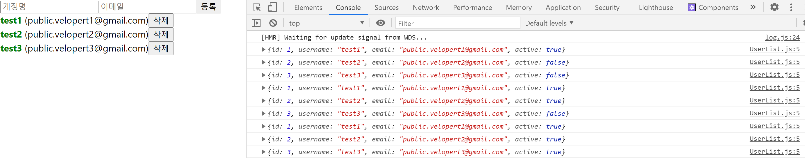

### useEffect Hook


이 함수를 사용하게되면 우리가 만든 리액트 컴포넌트가 처음화면에 나타나게될때 그리고 사라지게될때 특정 작업을 할 수 있다.

추가적으로 컴포넌트의 어떠한 props나 상태가 바뀌어 업데이트될 때에도 어떤 작업을 할 수 있고 업데이트되기 전에도 어떤 작업을 할 수 있다. 

deps를 빈배열로 설정하면 상태가 업데이트되더라도 동작하지 않고 컴포넌트가 나타날때 사라질때만 동작한다.

```react
import React, { useEffect } from "react";

function User({ user, onRemove, onToggle }) {
  //useEffect의 첫번째 파라미터에 우리가 실행하고자하는 함수를 넣어줌
  //두번째 파라미터에는 비어있는 배열을 넣어준다 => 이 배열을 deps(의존되는 값)라고 부른다.
  //의존되는 값들을 이 deps배열안에 넣어주면 되는데
  //만일 비어있으면 컴포넌트가 처음 화면에 나타날때만 실행이됨 => 상태가 업데이트된다고 해서 호출되지 않는다
  useEffect(() => {
    //1.컴포넌트가 mount 될때 특정작업을 해주는 부분
    // mount 란? 나타남 이라는 의미
    console.log("컴포넌트가 화면에 나타남");

    //props로 받은 값을 컴포넌트의 state로 설정
    //REST API(컴포넌트가 나타나면 특정 REST API를 요청할때도 사용)
    //D3, Video.js같은 라이브러리 사용할때
    //setInterval,setTimeout
    //함수가 호출되는 시점이 화면에 ui가 나타난 상태 이후이기 때문에 DOM에 바로 접근도 가능

    //2. 컴포넌트가 unmount될 때 특정작업을 해줄건데 이때 useEffect에서 작업해야할 함수를 반환해주면 된다. =>  return 함수
    // unmount란? 사라짐 이라는 의미
    return () => {
      //clearInterval,clearTimeout=>setInterval,setTimeout제거
      //라이브러리 인스턴스 제거
      console.log("컴포넌트가 화면에서 사라짐");
    };
  }, []);

  return ...
 
```

아래 이미지를 보면 test2가 사라질때 동작한것을 확인할 수 있으며 test3 컴포넌트의 상태가 업데이트 되어도 useEffect 내부 함수가 동작하지 않는것을 확인 할 수 있다. 


deps값으로 user를 넣었을 때 다음과 같이 동작한다.

```react
import React, { useEffect } from "react";

function User({ user, onRemove, onToggle }) {
  useEffect(() => {
    console.log("user값이설정됨");
    console.log(user);
    return () => { //return되는 함수는 뒷정리 함수로써 업데이트가되기 직전에도 동작을 하게된다.
      console.log("user 값이 바뀌기 전");
      console.log(user);
    };
  }, [user]); //user가 설정(mount될때!)되거나 업데이트가 되도 동작하게됨
    		// 어떤 상태나 props를 참조하고 있는 경우 deps는 그것을 넣어주는것이 규칙이다.

  return ...
```

test2가 가리키는 컴포넌트의 상태가 업데이트되면 업데이트 되기 전,후가 함께 출력된다.


deps값을 생략한경우를 살펴보자.

```react
import React, { useEffect } from "react";

function User({ user, onRemove, onToggle }) {
  useEffect(() => {
    console.log(user);
  }); //user가 설정(mount될때!)되거나 업데이트가 되도 동작하게됨

```




위의 이미지를 보면 바뀐 컴포넌트에 useEffect가 실행된것이 아니라 모든 자식 컴포넌트에서 useEffect가 실행되고 있다.

리액트 컴포넌트에서 부모 컴포넌트가 리렌더링되면 자식 컴포넌트도 리렌더링되는데 users 배열이 변하게되고 부모컴포넌트인 UserList 컴포넌트가 리렌더링 되면서 자식인 User컴포넌트가 모두 리렌더링 되면서 각각 User 컴포넌트에 useEffect가 실행된다. 물론 브라우저에서는 업데이트된것만 상태가 바뀐것만 업데이트되지만 가상돔에서는 모든 컴포넌트를 리렌더링하고 바뀐부분만 적용하고 있다. 

